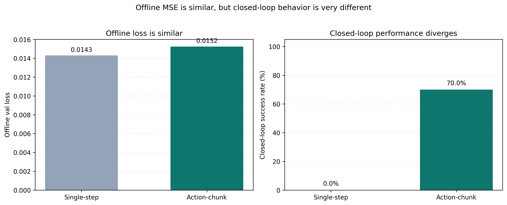
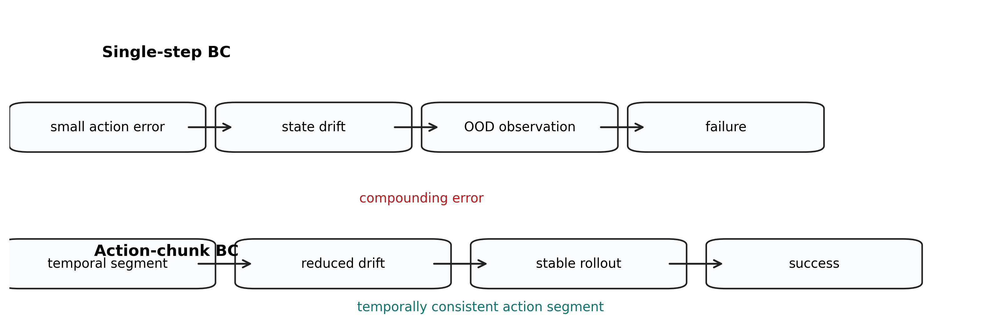
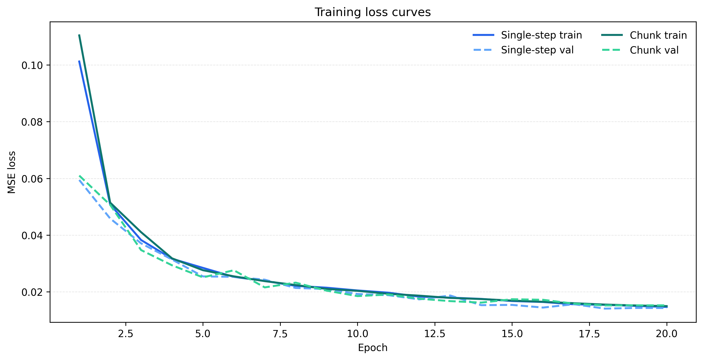

# OpenPI + LIBERO VLA Imitation Learning Pipeline

> A lightweight OpenPI + LIBERO imitation learning pipeline that distills π0.5 teacher rollouts into student policies and compares single-step vs action-chunk behavior cloning in closed-loop MuJoCo evaluation.

## Overview

This repository is a showcase of a small but complete imitation learning pipeline built on OpenPI, LIBERO, robosuite, and MuJoCo.

The project follows a teacher-student setup:

- roll out a strong OpenPI teacher policy (`pi05_libero`)
- collect trajectories from successful teacher episodes
- train two offline student baselines
- evaluate both students in closed-loop LIBERO simulation

This is a MuJoCo / LIBERO simulation project, not a real-robot deployment.

## Why This Project

The main question is practical:

- If a student policy matches teacher actions offline, does it also work in closed loop?

The answer in this pipeline is:

- single-step behavior cloning can fit the teacher reasonably well offline, but still fail in rollout due to compounding error;
- predicting short action chunks improves temporal consistency and gives much better closed-loop behavior.

## Pipeline

```text
π0.5 teacher rollout
→ trajectory collection
→ single-step student BC
→ action-chunk student BC
→ closed-loop evaluation
```

## Key Results

| Stage | Setup | Result |
|---|---|---:|
| Teacher π0.5 | `LIBERO spatial` rollout | `492/500` success, `98.4%` |
| Single-step student | `image + wrist_image + state → 7D action` | offline `val_loss ≈ 0.0143`, closed-loop `0/10` |
| Action-chunk student | `image + wrist_image + state → 10x7 action chunk` | offline `val_loss ≈ 0.0152`, closed-loop `35/50`, `70.0%` |

## Figures








## Repository Structure

```text
openpi-libero-vla-imitation/
├── scripts/              # copied experiment scripts
├── figures/              # generated figures for README / report
├── results_summary/      # concise markdown summaries
├── docs/                 # method, results, limitations, planning notes
├── README.md
├── .gitignore
└── LICENSE
```

## How to Reproduce

The showcase is intentionally lightweight. The key commands are:

### Teacher rollout

```bash
uv run /home/lin17/openpi/scripts/serve_policy.py --env LIBERO
python /home/lin17/openpi/examples/libero/main.py
```

### Trajectory collection

```bash
python scripts/collect_trajectories.py
```

### Dataset inspection

```bash
env UV_CACHE_DIR=/tmp/uv-cache uv run python scripts/inspect_collected_dataset.py --dataset-dir results/libero_dataset_500 --seed 7 --sample-episodes 3
```

### Single-step student training

```bash
env UV_CACHE_DIR=/tmp/uv-cache uv run python scripts/train_student_bc.py --dataset-dir results/libero_dataset_500 --save-dir results/libero_student_bc --epochs 20 --batch-size 64 --lr 1e-3 --num-workers 4 --val-ratio 0.1
```

### Single-step student evaluation

```bash
env UV_CACHE_DIR=/tmp/uv-cache uv run python scripts/eval_student_bc.py --model-path results/libero_student_bc/best_model.pt --task-suite-name libero_spatial --seed 7
```

### Action-chunk student training

```bash
env UV_CACHE_DIR=/tmp/uv-cache uv run python scripts/train_student_chunk_bc.py --dataset-dir results/libero_dataset_500 --save-dir results/libero_student_chunk_bc --chunk-size 10 --epochs 20 --batch-size 64 --lr 1e-3 --num-workers 4 --val-ratio 0.1
```

### Action-chunk student evaluation

```bash
env UV_CACHE_DIR=/tmp/uv-cache uv run python scripts/eval_student_chunk_bc.py --model-path results/libero_student_chunk_bc/best_model.pt --task-suite-name libero_spatial --seed 7 --chunk-size 10
```

### Figure generation

```bash
python make_figures.py
```

## Main Findings

- Teacher π0.5 achieves strong success on `libero_spatial`.
- Single-step student BC can match teacher actions offline but fails in closed-loop rollout.
- Action-chunk BC keeps a short-horizon temporal structure and improves control stability.
- Offline MSE alone is not sufficient to judge closed-loop policy quality.

Rollout visualizations will be added later.

## Troubleshooting

- WSL proxy: if package download or network access fails, check proxy variables and local cache settings.
- Checkpoint corruption / `gsutil rsync`: if `torch.load` fails, re-fetch or re-sync the checkpoint and verify the file is complete.
- `torch.load(weights_only=...)`: keep checkpoint format simple and load `model_state_dict` explicitly.
- MuJoCo headless rendering: use `MUJOCO_GL=osmesa PYOPENGL_PLATFORM=osmesa` for headless runs.

## Limitations

- This repository only covers MuJoCo / LIBERO simulation, not a real robot.
- The student policies are lightweight CNN + MLP baselines, not a full VLA stack.
- No checkpoint, dataset, or model weights are uploaded here.
- The student evaluation is limited in scale and should not be treated as a full benchmark sweep.
- Future work can extend this to ROS / MoveIt, Isaac Sim, and stronger imitation baselines.

## Future Work

- add prompt embedding
- add history frames
- stronger visual encoder
- ACT / Diffusion Policy baseline
- Isaac Sim high-fidelity simulation
- ROS/MoveIt action adapter for real robot deployment

## Further Reading

- [docs/method.md](docs/method.md)
- [docs/results.md](docs/results.md)
- [docs/limitations.md](docs/limitations.md)
- [docs/visualization_plan.md](docs/visualization_plan.md)
- [results_summary/experiment_summary.md](results_summary/experiment_summary.md)
- [results_summary/result_table.md](results_summary/result_table.md)
- [results_summary/commands.md](results_summary/commands.md)
