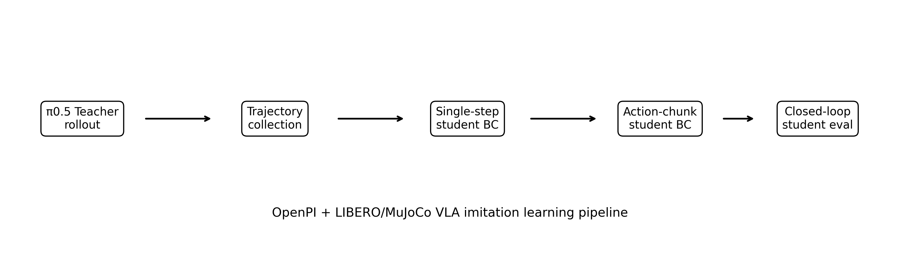
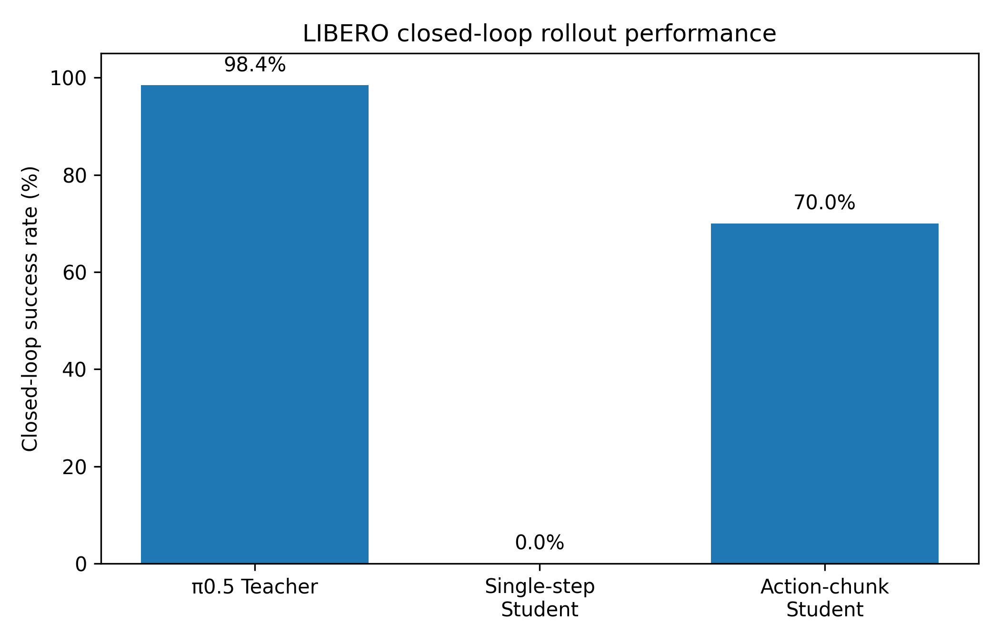

# OpenPI + LIBERO VLA Imitation Learning Pipeline

A compact showcase of a teacher-student imitation learning pipeline built on OpenPI / π0.5, LIBERO, robosuite, and MuJoCo, with headless OSMesa support for CI and remote runs.

## Pipeline

π0.5 teacher rollout → trajectory collection → single-step student BC → action-chunk student BC → closed-loop evaluation

## Environment

- OpenPI
- pi05_libero checkpoint
- LIBERO
- robosuite
- MuJoCo
- OSMesa headless rendering

## Main Results

| Stage | Result |
|---|---|
| Teacher π0.5 | `492/500`, `98.4%` |
| Single-step student | `val_loss ≈ 0.0143`, closed-loop `0/10` |
| Action-chunk student | `val_loss ≈ 0.0152`, closed-loop `35/50`, `70.0%` |

## Run Commands

See [`results_summary/commands.md`](results_summary/commands.md) for reproducible commands for rollout, collection, inspection, training, and evaluation.

## Troubleshooting

- WSL proxy: if downloads or package resolution fail, check proxy variables and prefer local caches.
- Checkpoint corruption / `gsutil rsync`: re-fetch or re-sync the checkpoint if `torch.load` fails unexpectedly.
- `torch.load(weights_only=...)`: use a simple checkpoint format with `model_state_dict` and metadata.
- MuJoCo headless rendering: set `MUJOCO_GL=osmesa PYOPENGL_PLATFORM=osmesa` for headless runs.

## Limitations

- This project is MuJoCo / LIBERO simulation only, not real hardware.
- The student is a lightweight BC baseline, not a full VLA system.
- No checkpoint, dataset, or model weights are uploaded here.
- Future extensions can target ROS/MoveIt, Isaac Sim, and stronger imitation baselines.

## Future Work

- add prompt embedding
- add history frames
- stronger visual encoder
- ACT / Diffusion Policy baseline
- Isaac Sim high-fidelity simulation
- ROS/MoveIt action adapter for real robot deployment

## Pipeline

## Main Results

