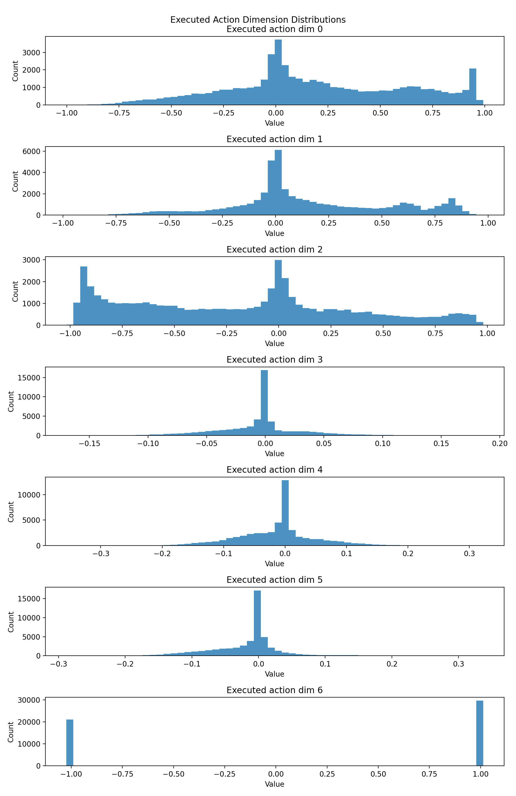
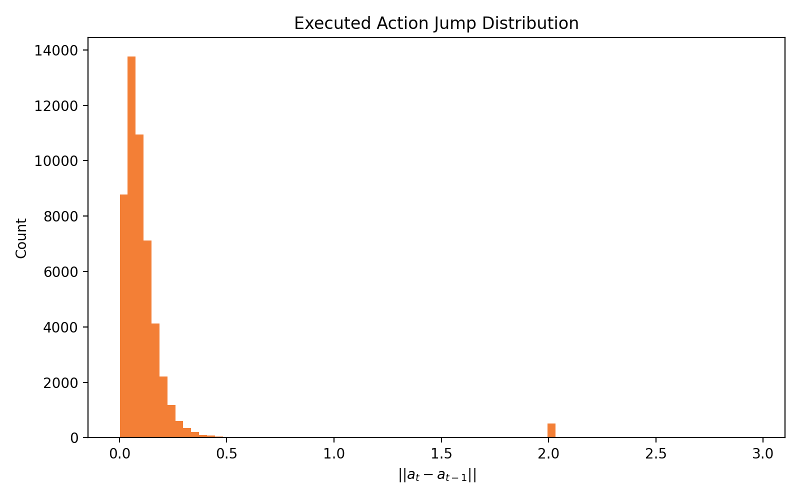
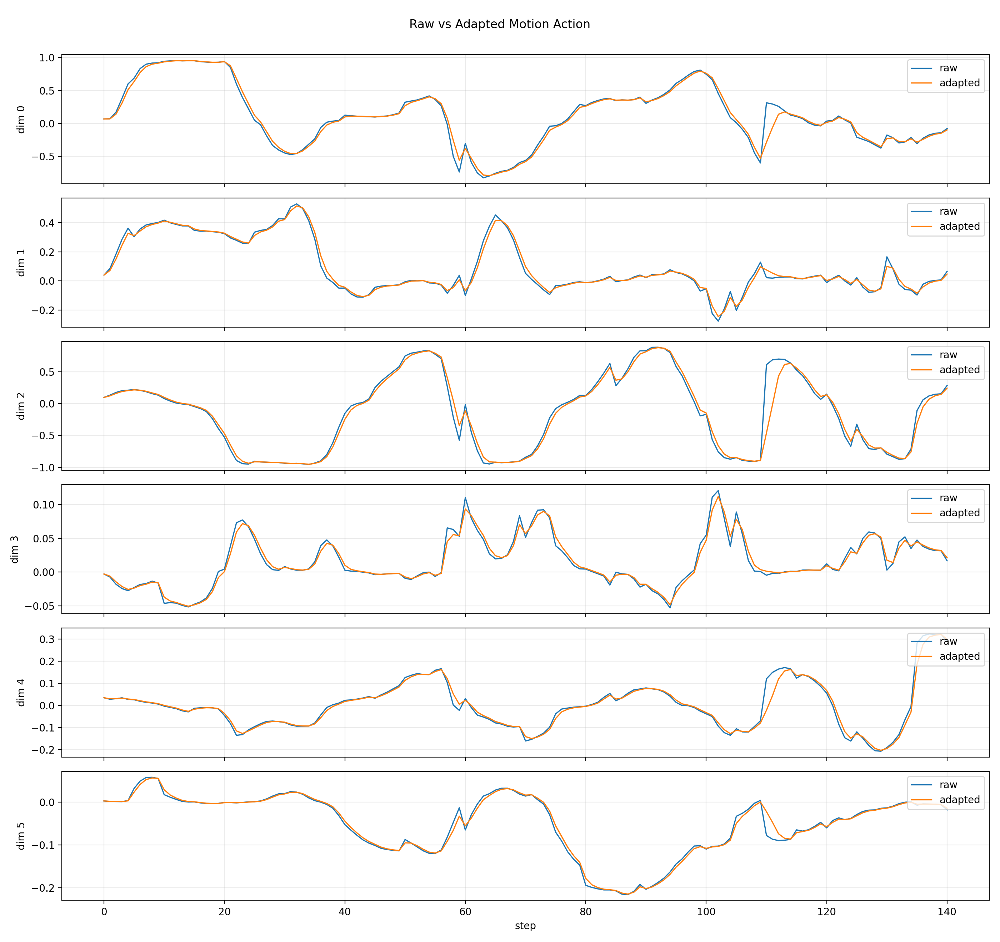
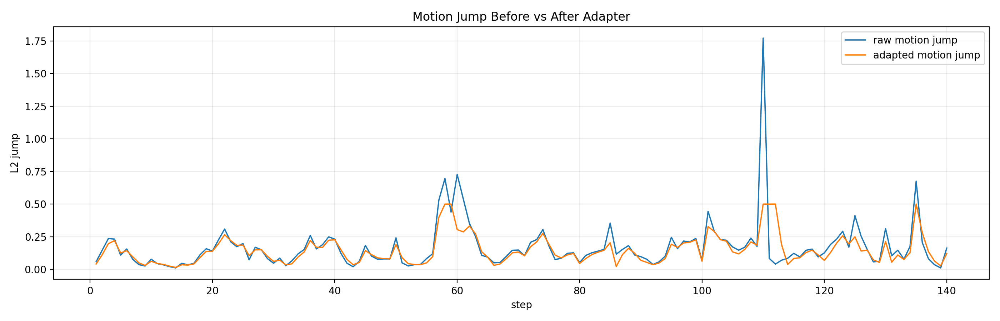
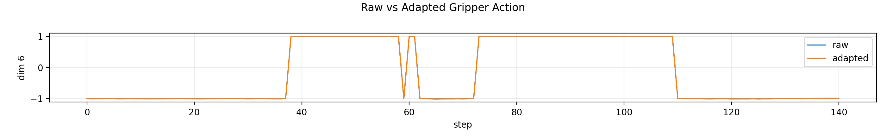
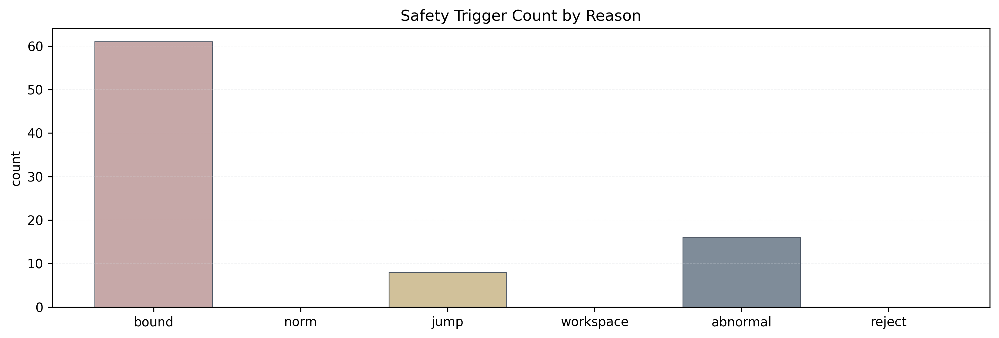

# VLA Action Bridge and Safety Layer Summary

## 1. Data Source

- 数据来自 `results/libero_dataset_500`
- 共分析 `488` 个 `actions.npy` 文件
- 共 `50,713` 个 executed actions
- `action_dim = 7`

## 2. Action Semantics

- 当前 LIBERO 环境基于 `robosuite`
- 内部 controller 是 `robosuite.controllers.osc.OperationalSpaceController`
- 因此 7D action 可解释为：
  - `action[0:6]`：6D end-effector operational-space motion action
  - `action[6]`：gripper open/close command
- 前 6 维 motion 与 gripper 维度需要分开处理

## 3. Action Space Audit

- action norm mean `≈ 1.29`
- action norm max `≈ 1.72`
- action jump mean `≈ 0.12`
- action jump max `≈ 2.95`
- 说明大部分 action 较平稳，但存在少数较大跳变，因此需要 adapter / safety filter

## 4. Offline Action Adapter

- ActionAdapter 对 motion dims 执行：
  - clipping
  - exponential smoothing
  - jump limiting
  - optional scaling
- gripper dim 单独 clamp / threshold
- 这是离线 action bridge demo，不代表已经重新在线执行 adapted actions

### Adapter Batch Summary

- `results_summary/action_adapter_demo/adapter_batch_summary.json`
- `results_summary/action_adapter_demo/adapter_batch_summary.csv`

关键 aggregate 结果：

- `num_files = 488`
- `num_steps = 50,713`
- raw motion norm mean `≈ 0.786`
- adapted motion norm mean `≈ 0.781`
- raw motion norm max `≈ 1.390`
- adapted motion norm max `≈ 1.379`
- raw motion jump mean `≈ 0.099`
- adapted motion jump mean `≈ 0.091`
- raw motion jump max `≈ 2.174`
- adapted motion jump max `≈ 0.500`
- `norm_clipped_count = 0`
- `jump_clipped_count = 61`
- `bound_clipped_count = 28,923`
- `gripper_thresholded_count = 50,713`

这些结果说明 adapter 主要在 motion jump 和 gripper 维度上起作用，能够明显压制极端跳变，同时保留整体动作趋势。

## 5. Offline Safety Filter

- SafetyFilter 执行：
  - per-dimension bound check
  - motion norm check
  - motion jump check
  - consecutive abnormal action detection
  - optional workspace check
  - reject / fallback mechanism
- SafetyFilter 是 ActionAdapter 后面的 safety gate

## 6. Key Figures

可用图：

- `figures/action_bridge/action_dim_distribution.png`
- `figures/action_bridge/action_jump_hist.png`
- `figures/action_bridge/adapter_raw_vs_adapted.png`
- `figures/action_bridge/adapter_action_jump_before_after.png`
- `figures/action_bridge/adapter_action_norm_before_after.png`
- `figures/action_bridge/adapter_gripper_compare.png`
- `figures/action_bridge/safety_action_jump_before_after.png`
- `figures/action_bridge/safety_action_norm_before_after.png`
- `figures/action_bridge/safety_trigger_count.png`

可用图片展示：

## 7. Limitations

- 当前是 offline action bridge / safety layer analysis
- 没有重新在线执行 `adapted_actions` / `safe_actions`
- 不等价于真实机器人安全验证
- 后续可接回 `LIBERO env.step(action)`，或接入真实机器人 SDK / ROS controller 前作为 safety gate

## 8. Resume Bullets

1. 基于 OpenPI/pi0.5 与 LIBERO 完成 VLA teacher rollout / student imitation，并采集 488 条轨迹、50,713 个 executed actions。
2. 解析 LIBERO/robosuite `OperationalSpaceController` 下的 7D action 语义，确认其对应 6D 末端操作空间控制量与 1D 夹爪命令，并完成 action norm / jump 分布分析。
3. 设计离线 VLA action adapter 与 safety filter，对末端 motion action 进行限幅、平滑、跳变约束和安全触发统计，并将 gripper 命令单独处理，模拟真实机器人部署前的动作安全中间层。
